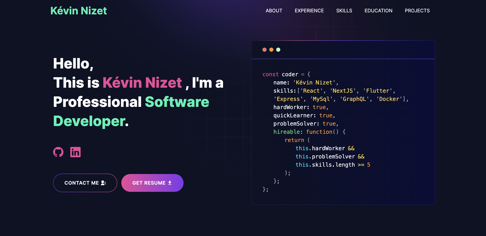

# Portfolio de Kévin Nizet

### Welcome to my development portfolio !

This portfolio showcases a selection of my projects and achievements in software development. I'm passionate about creating innovative and functional solutions, and this portfolio reflects my journey and skills in development.

### How to reach me :memo:

Email: [kevin.nizet@gmail.com]
LinkedIn: [https://www.linkedin.com/in/kevinnizet/]

Feel free to explore my projects above and reach out to me for any collaboration or professional opportunities!

---

# Demo :movie_camera:



//TODO: add production link when available

<!-- ## View live preview [here](https://knizet.netlify.app/). -->

---

## Table of Contents :scroll:

- [Sections](#sections-bookmark)
- [Demo](#demo-movie_camera)
- [Installation](#installation-arrow_down)
- [Getting Started](#getting-started-dart)
- [Usage](#usage-joystick)
- [Packages Used](#packages-used-package)

---

# Sections :bookmark:

- HERO SECTION
- ABOUT ME
- EXPERIENCE
- SKILLS
- PROJECTS
- EDUCATION
- CONTACTS

---

# Installation :arrow_down:

### You will need to download Git and Node to run this project

- [Git](https://git-scm.com/downloads)
- [Node](https://nodejs.org/en/download/)

#### Make sure you have the latest version of both Git and Node on your computer.

```
node --version
git --version
```

## <br />

# Getting Started :dart:

### Fork and Clone the repo

To Fork the repo click on the fork button at the top right of the page. Once the repo is forked open your terminal and perform the following commands

```
git clone https://github.com/<YOUR GITHUB USERNAME>/portfolio.git

cd portfolio
```

### Install packages from the root directory

```bash
npm install
# or
yarn install
```

Then, run the development server:

```bash
npm run dev
# or
yarn dev
```

Open [http://localhost:3000](http://localhost:3000) with your browser to see the result.

---

# Usage :joystick:

Goto [emailjs.com](https://www.emailjs.com/) and create a new account for the mail sending. In free trial you will get 200 mail per month. After setup `emailjs` account, Please create a new `.env` file from `.env.example` file.

Eg:

```env
NEXT_PUBLIC_EMAILJS_SERVICE_ID =
NEXT_PUBLIC_EMAILJS_TEMPLATE_ID =
NEXT_PUBLIC_EMAILJS_PUBLIC_KEY =
```

---

# Packages Used :package:

| Used Package List  |
| :----------------: |
|        next        |
|  @emailjs/browser  |
|    lottie-react    |
| react-fast-marquee |
|    react-icons     |
|   react-toastify   |
|        sass        |
|    tailwindcss     |

---

# Credits :bulb:

This projects is freely inspired from @Abu Said
