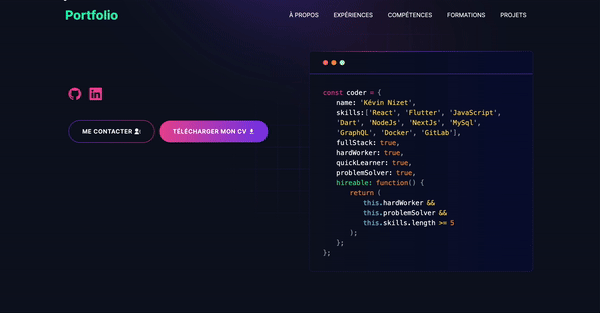

# Kévin Nizet's Portfolio

### Welcome to my development portfolio !

This portfolio showcases a selection of my projects and achievements in software development. I'm passionate about creating innovative and functional solutions, and this portfolio reflects my journey and skills in development.

### How to reach me :memo:

Email : [kevin.nizet@gmail.com](kevin.nizet@gmail.com)

LinkedIn : [link](https://www.linkedin.com/in/kevinnizet)

Feel free to explore my projects above and reach out to me for any collaboration or professional opportunities !

---

# Demo :movie_camera:



## View live preview [here](https://kevinnizet-portfolio.vercel.app).

---

## Table of Contents :scroll:

- [Sections](#sections-bookmark)
- [Demo](#demo-movie_camera)
- [Installation](#installation-arrow_down)
- [Getting Started](#getting-started-dart)
- [Usage](#usage-joystick)
- [Packages Used](#packages-used-package)

---

# Sections :bookmark:

- HERO SECTION
- ABOUT ME
- EXPERIENCES
- SKILLS
- PROJECTS
- EDUCATION
- CONTACT

---

# Installation :arrow_down:

### You will need to download Git and Node to run this project

- [Git](https://git-scm.com/downloads)
- [Node](https://nodejs.org/en/download/)

#### Make sure you have the latest version of both Git and Node on your computer.

```
node --version
git --version
```

## <br />

# Getting Started :dart:

### Install packages from the root directory

Once you have fork and clone the repo, you should install all the packages.

```bash
npm install
# or
yarn install
```

Then, run the development server:

```bash
npm run dev
# or
yarn dev
```

Open [http://localhost:3000](http://localhost:3000) with your browser to see the result.

---

# Usage :joystick:

On [emailjs.com](https://www.emailjs.com/) you can create a new account for the mail sending. After setup `emailjs` account, you should create a new `.env` file from `.env.example` file.

Eg:

```env
NEXT_PUBLIC_EMAILJS_SERVICE_ID =
NEXT_PUBLIC_EMAILJS_TEMPLATE_ID =
NEXT_PUBLIC_EMAILJS_PUBLIC_KEY =
```

---

# Packages Used :package:

| Used Package List  |
| :----------------: |
|        next        |
|  @emailjs/browser  |
|    lottie-react    |
| react-fast-marquee |
|    react-icons     |
|   react-toastify   |
|  typwriter-effect  |
|   react-toastify   |
|        sass        |
|    tailwindcss     |

---

# Credits :busts_in_silhouette:

This projects is freely inspired from @Abu Said open source project
